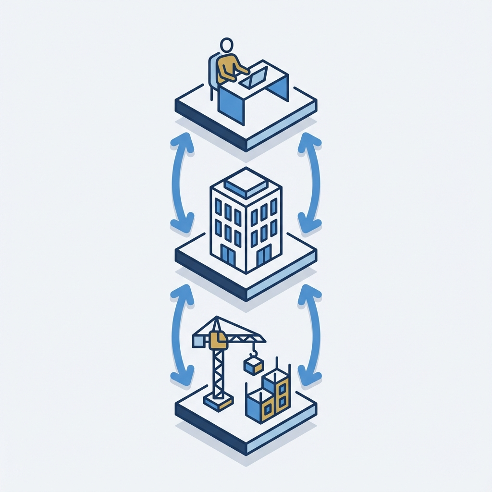
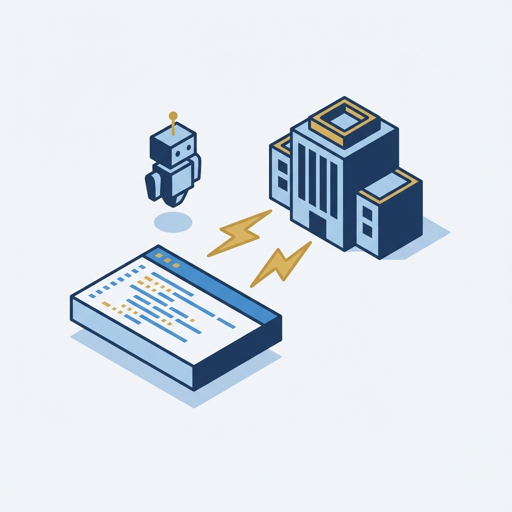
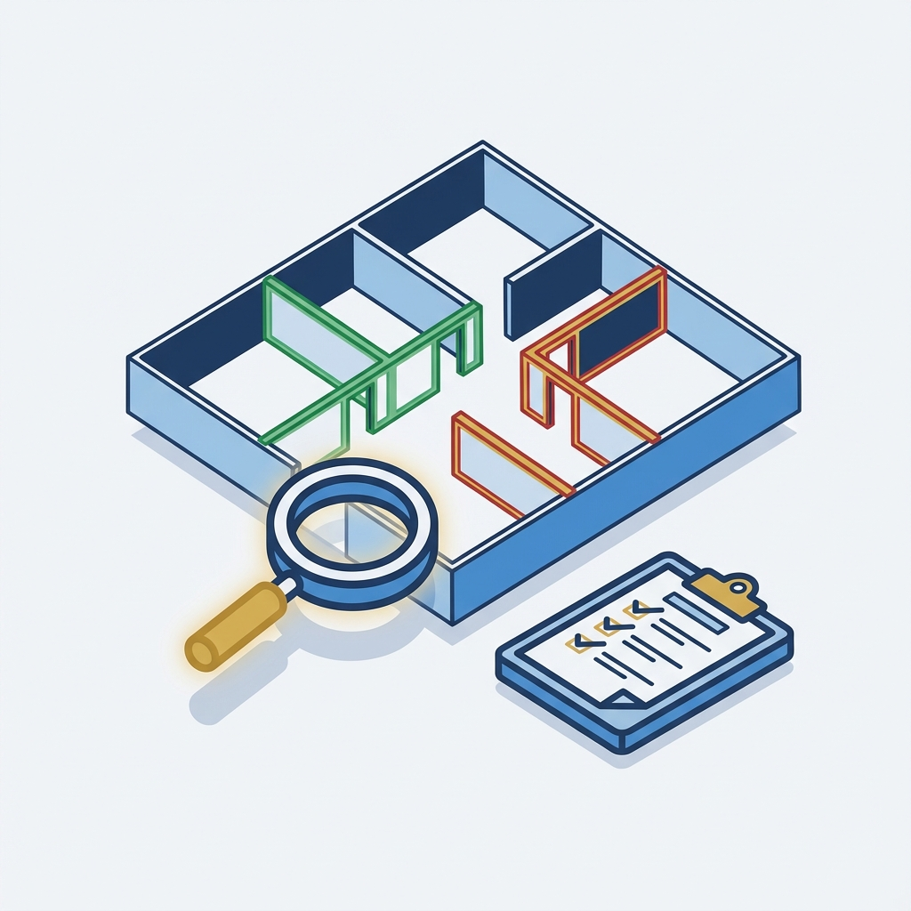
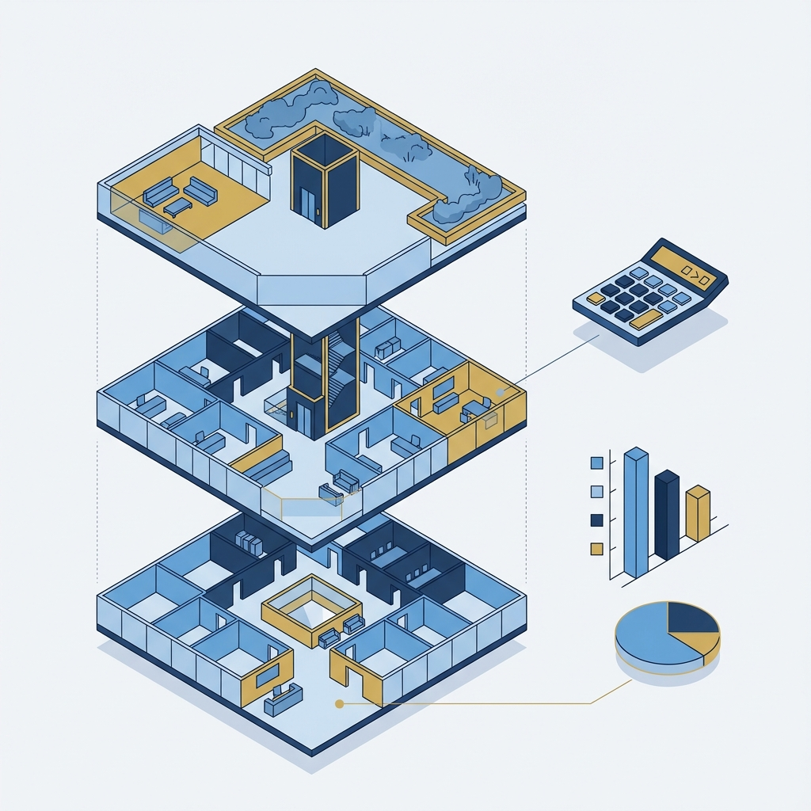
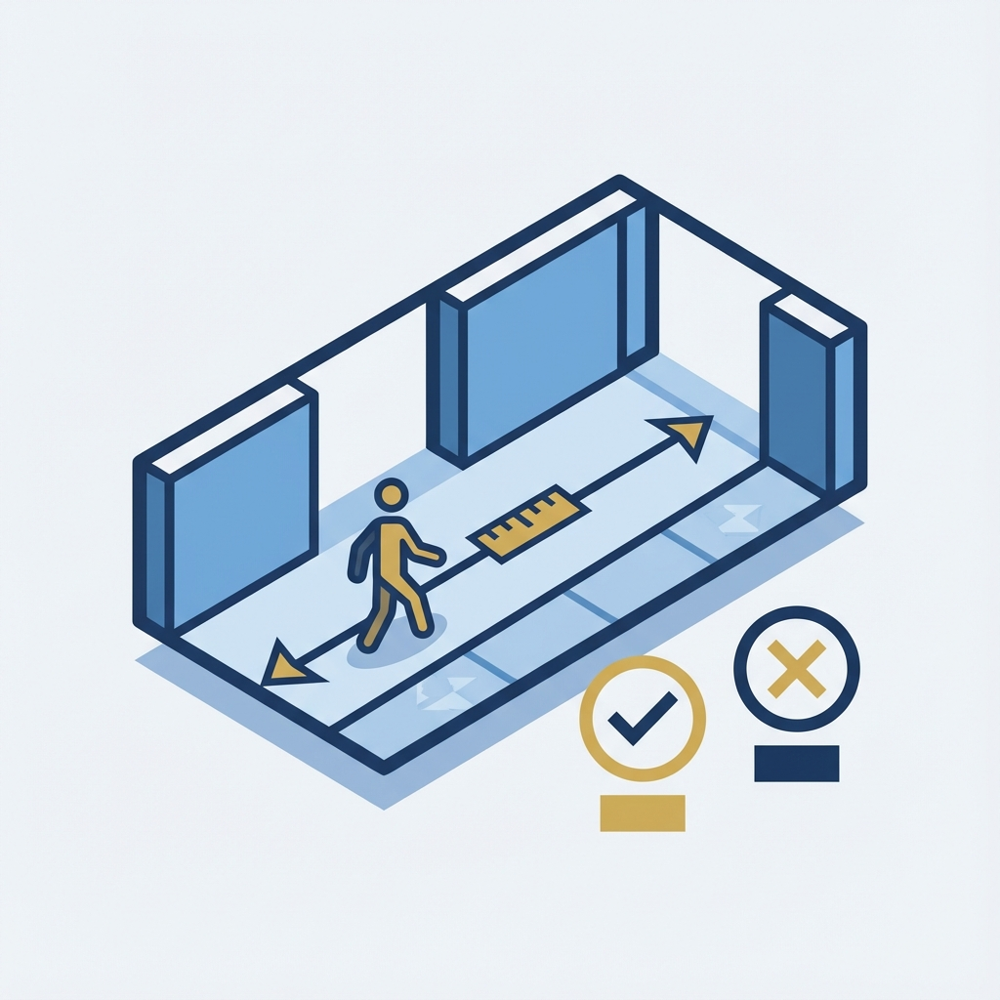
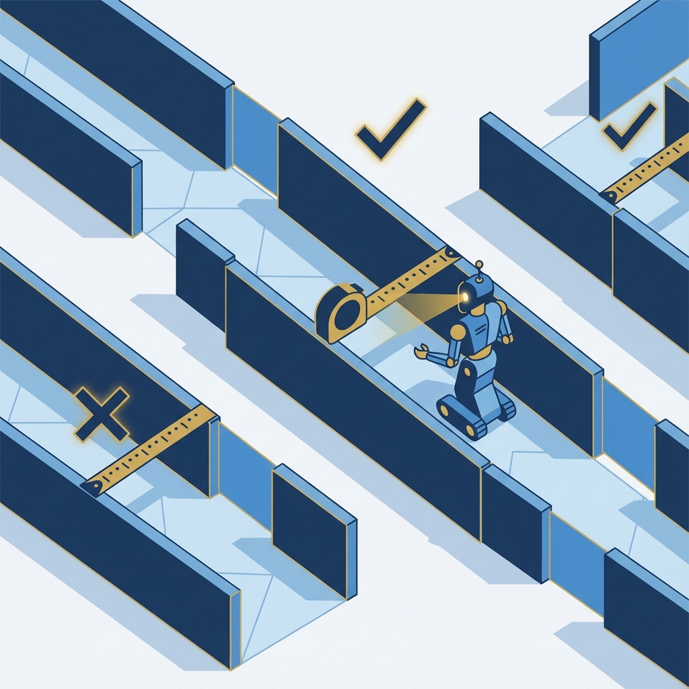
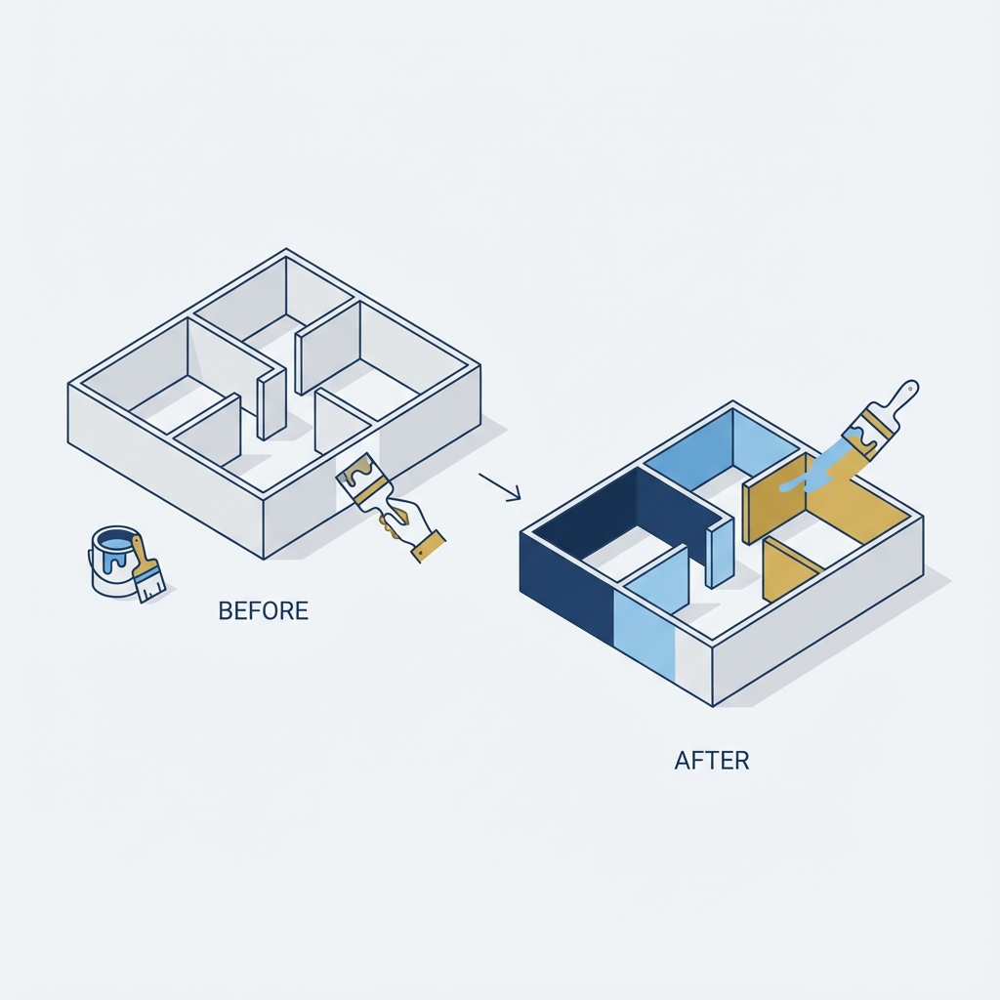
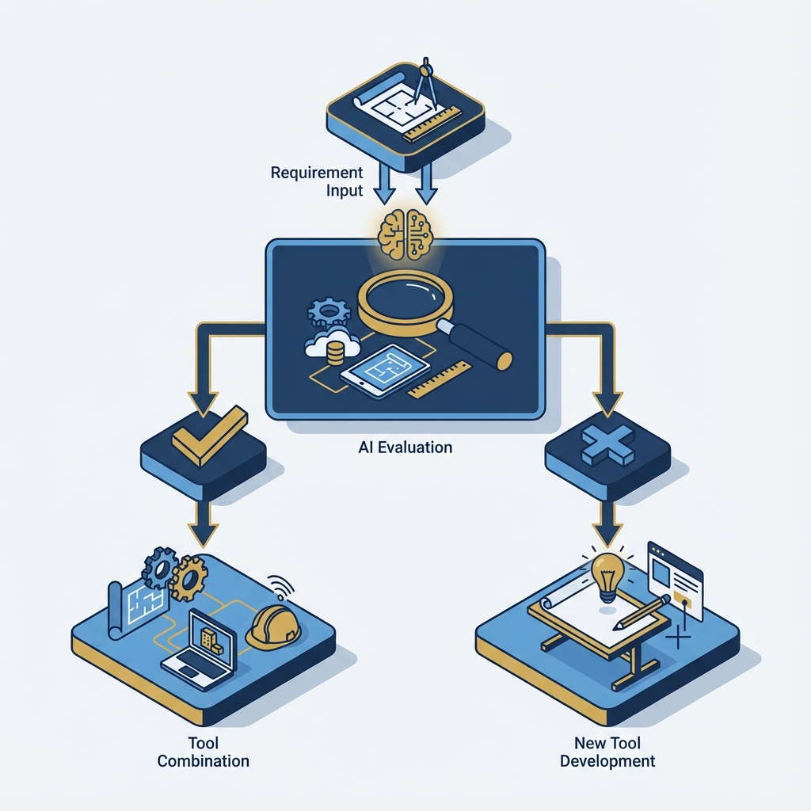

# AI x Revit
## 建築實務課程
### 一、認識篇


<!-- note:
「各位建築師好！今天我們要學的不是程式語言，而是如何用『自然的中文』讓 AI 幫你操作 Revit。

這張圖左邊是 AI 大腦，右邊是 BIM 建築模型。中間的連線代表我們今天要學的東西——如何讓這兩者順暢地溝通。

課程結束後，你會發現原本需要 2-3 小時的防火檢查，可以在 10 分鐘內完成。」

**關鍵訊息**：
- 這是給建築師的課程，不是給程式設計師的
- 重點是「說話」而不是「寫程式」
- AI 是你的翻譯官，幫你把想法變成 Revit 操作
-->

---

# 📋 課程協作方式

**本課程採用 Git 協作**

```
┌──────────────────┐
│  老師的 Repo     │ ← 您正在看的原始版本
└────────┬─────────┘
         │ Fork（複製到您的帳號）
         ▼
┌──────────────────┐
│  您的 Repo       │ ← 屬於您自己的版本
└────────┬─────────┘
         │ Clone（下載到電腦）
         ▼
┌──────────────────┐
│  您的電腦        │ ← 實際操作的地方
└──────────────────┘
```

<!-- note:
**開宗明義說明協作方式（5 分鐘）：**

「在開始課程前，我們先確認大家都用正確的方式取得教材。

**為什麼用 Fork？**
- Fork = 複製一份到你自己的帳號
- 這樣你可以自由修改、不會影響我的原版
- 而且你開發的 domain 可以貢獻回來給大家用！

**請現在確認**：
1. 你的 GitHub 帳號有這個專案嗎？
2. 網址是 github.com/你的帳號/REVIT_MCP_study 嗎？
3. 如果不是，請現在 Fork 一下」
-->

---

# 🔄 知識貢獻流程

**當您開發出好用的 domain：**

| 步驟 | 指令 | 說明 |
|:----|:----|:----|
| 1️⃣ 產生 | `/domain ...` | 讓 AI 幫你產生 SOP |
| 2️⃣ 提交 | `git add domain/新檔.md` | 加入版本控制 |
| 3️⃣ 推送 | `git commit + push` | 上傳到您的 Repo |
| 4️⃣ 貢獻 | 發 Pull Request | 請老師審核合併 |

<!-- note:
**說明貢獻流程（5 分鐘）：**

「當你用 AI 開發出一個好用的工作流程，你可以分享給全班！

**完整指令**：
```bash
# 1. 讓 AI 產生 domain
/domain 我剛才做的 XXX 流程很成功，請幫我存成 SOP

# 2. 確認檔案產生了
ls domain/

# 3. 提交變更
git add domain/我的新流程.md
git commit -m "新增: XXX 工作流程"
git push

# 4. 到 GitHub 發 Pull Request
```

**注意**：只提交 `domain/` 和 `GEMINI.md` 的變更！
其他程式碼檔案請不要修改。」
-->

---

# 🔃 同步老師的更新

**定期取得其他人的貢獻：**

1. 到 GitHub 您的 Repo 頁面
2. 點擊「Sync fork」按鈕
3. 本機執行 `git pull`

```bash
# 取得最新內容
git pull
```

<!-- note:
**說明同步流程（3 分鐘）：**

「當老師合併了其他同學的貢獻，你需要同步過來：

**GitHub 頁面操作**：
1. 進入你的 Repo 頁面
2. 會看到 'This branch is X commits behind'
3. 點擊 'Sync fork' → 'Update branch'
4. 回到本機執行 `git pull`

**建議頻率**：每週上課前同步一次。」
-->

---

# 傳統 vs AI 輔助工作流程


| 任務 | 傳統 | AI 輔助 |
|:----|:---:|:------:|
| 防火檢查 | 2-3 hr | 10 min |
| 容積計算 | 1 hr | 5 min |
| 走廊標註 | 30 min/層 | 2 min/層 |

<!-- note:
**說明重點（3-4 分鐘）：**

「看這張圖，左邊是我們熟悉的場景——桌上堆滿文件、時鐘指向深夜、頭痛的建築師...
右邊呢？同樣的工作，但有 AI 機器人幫忙，時鐘只走了 2 小時，人輕鬆坐在椅子上。」

**具體數據對比**（可寫在白板上）：
- 防火等級全案檢查：2-3 hr -> 10 min
- 容積計算報告：1 hr -> 5 min
- 走廊寬度標註：30 min/層 -> 2 min/層

**提問互動**：
- 「在座有誰花超過 2 小時做過防火檢查的？」（舉手調查）
- 「如果這件事可以 10 分鐘完成，你省下的時間想做什麼？」
-->

---

# 技術架構簡化版



**三層結構**：
- 你 = 業主/建築師
- AI = 總工程師
- Revit = 工地現場

你說話 → AI 翻譯 → Revit 執行

<!-- note:
**說明重點（4-5 分鐘）：**

「這張圖是你今天唯一需要理解的技術概念。

- **最上層**：你，坐在電腦前說話的那個人
- **中間層**：AI 總工程師辦公室，負責翻譯你的話
- **最下層**：Revit 工地，實際執行操作

你說：『把防火時效不足的牆標紅色』
AI 理解後，轉成 Revit 聽得懂的指令
Revit 執行，牆就變紅了

你不需要知道中間怎麼運作的，就像你不需要知道手機訊號怎麼傳到基地台。」

**建築類比**：
- 你 = 業主 + 建築師（發出需求）
- AI = 總工程師（翻譯成施工圖）
- Revit = 工地（實際施工）
-->

---

# ⭐ 自然語言 vs 斜線指令


| 特性 | 自然語言 | 斜線指令 |
|:----|:-------:|:-------:|
| 彈性 | 高 | 低 |
| 一致性 | 不定 | 相同 |
| 適合 | 探索新任務 | 重複執行 |

**第一次用自然語言，成功後變斜線指令**

<!-- note:
**這是本堂課最重要的概念！（8-10 分鐘）**

「這張圖是今天的核心概念。左邊是自然語言對話——就像我們平常聊天，想到什麼說什麼。右邊是斜線指令——像工地的標準作業程序，每次都照著走。」

**使用時機口訣**：
- 「第一次做，用自然語言探索」
- 「做成功了，變成斜線指令重複用」

**提問互動**：
- 「如果你今天要做一件從沒做過的事，你會用哪一種？」
- 「如果這件事你每週都要做一次呢？」
-->

---

# 知識累積流程


```
成功對話
    ↓
┌───────────┬───────────┐
│ /lessons  │ /domain   │
│ 高階規則  │ SOP流程   │
│ →GEMINI.md│ →domain/  │
└───────────┴───────────┘
```

<!-- note:
**說明知識演進過程（5 分鐘）：**

這張圖是整個課程的核心概念之一。

**兩個指令的區別**：
- **`/lessons`**：提煉高階規則和經驗教訓，寫入 `GEMINI.md` 末尾
- **`/domain`**：將具體工作流程轉換為 SOP 格式，存入 `domain/*.md`

**舉例說明**：
- `/lessons`：「走廊識別需要多語言容錯」→ 規則記在 GEMINI.md
- `/domain`：「走廊寬度檢查流程」→ 完整 SOP 存在 domain/corridor-analysis.md
-->


---

# 二、MCP 架構解析
## 用建築視角理解系統


```
你 + AI Client
    ↓ 自然語言
MCP Server（翻譯與調度）
    ↓ WebSocket:8964
Revit Add-in（現場執行）
```

<!-- note:
「上一堂課我們看過這張圖。今天我們要更深入地理解每一層在做什麼。

把這個系統想像成一個建築專案：
- **最上層**：業主 + 建築師 = 你 + AI Client
- **中間層**：總工程師辦公室 = MCP Server
- **最下層**：工地現場 = Revit Add-in」

**建築類比對照表**（建議寫白板）：
- AI Client = 業主+建築師 (發出需求)
- MCP Server = 總工程師 (翻譯成施工計畫)
- Revit Add-in = 工地主任 (現場執行)
- WebSocket = 對講機 (即時溝通)
-->

---

# 六種檔案類型（上）


| 檔案 | 建築類比 |
|:----|:--------|
| **.json** | 聯絡簿、設定表 |
| **.ts/.js** | 總工程師手冊 |
| **.cs** | 施工手冊 |

<!-- note:
**這是本堂課重點！（15-20 分鐘）**
逐一解釋每個圖示代表的檔案類型：

**1️⃣ 齒輪圖示 = .json（設定檔）**
「這就像專案的聯絡人清單和設定表。建築類比：就像工程設定表，寫著專案經理電話、工地地址、開工日期。」

**2️⃣ 括號圖示 = .ts/.js（TypeScript/JavaScript）**
「這是總工程師的工作手冊。建築類比：總工程師的 SOP，寫著『收到建牆需求時，要確認長度、材料、位置』。」

**3️⃣ 板手+書本圖示 = .cs（C#）**
「這是工地師傅的施工手冊。寫著：如果接到 create_wall 的指令，就拿起工具，照著這個步驟砌一面牆。」
-->

---

# 六種檔案類型（下）


| 檔案 | 建築類比 |
|:----|:--------|
| **.dll** | 預鑄構件（編譯成品） |
| **.addin** | 進場許可證 |
| **.md** | SOP 規範手冊 |

<!-- note:
**4️⃣ 拼圖圖示 = .dll（編譯後程式庫）**
「這是工廠做好的預鑄構件。.cs 是設計圖(原始碼)，.dll 是成品(可執行)。修改 .cs 後要『重新生產』才會更新 .dll。」

**5️⃣ 徽章圖示 = .addin（Revit 外掛設定）**
「這是進場許可證。給 Revit 看的，沒有這張許可證，Revit 不會讓外掛進來。」

**6️⃣ 檢查表圖示 = .md（Markdown）**
「這是施工規範書、SOP 手冊。寫給 AI 看的，告訴它：如果有人說『檢查防火』，就照著這些步驟做。這就是我們的 domain/*.md 檔案。」
-->

---

# 安裝四步驟


1. **下載** Node.js
2. **編譯** .cs → .dll
3. **部署** 到 Revit Addins 目錄
4. **連接** AI Client 設定

預計時間：25 分鐘

<!-- note:
**說明安裝流程（3 分鐘）：**

「這張圖顯示安裝的四個步驟。從左到右：
1. **下載**：安裝 Node.js
2. **編譯**：把 .cs 變成 .dll
3. **部署**：把 .dll 放到對的位置
4. **連接**：設定 AI Client」
-->

---

# Revit SDK 文件


**你不需要看懂程式碼**

只需要問 AI：
「我想做 XXX，Revit SDK 有沒有這個功能？」

AI 會幫你查、幫你寫

<!-- note:
**預告進階內容（5 分鐘）：**

「這張圖顯示：文件 -> API -> 建築模型。這是第六堂課『工具開發協作』的預告。

當你需要的工具現有清單沒有時，你可以和 AI 一起開發新工具。而這本書——Revit SDK 文件——就是你們的參考資料。」

**重點強調**：
「你不需要看懂程式碼，你只需要會問 AI：『我想做 XXX，Revit SDK 有沒有對應的功能？』
AI 會幫你查、幫你設計、幫你寫程式碼。你只負責說清楚需求。」
-->

---

# 三、安裝篇
## 25 分鐘完成安裝


---

# 版本對應表


| Revit 版本 | 專案檔 | 警告數 |
|:----------|:------|:------:|
| 2022 | RevitMCP.csproj | 0 |
| 2023 | RevitMCP.csproj | 0 |
| **2024** | RevitMCP.**2024**.csproj | 56（正常） |

⚠️ 2024 版 56 個警告是**正常的**！
（為了相容性使用舊版寫法）

<!-- note:
**版本對應說明（3 分鐘）：**

| Revit 版本 | 專案檔 | 輸出路徑 | 警告數 |
|:----------|:------|:--------|:------:|
| 2022 | RevitMCP.csproj | bin\Release\ | 0 |
| 2023 | RevitMCP.csproj | bin\Release\ | 0 |
| 2024 | RevitMCP.2024.csproj | bin\Release.2024\ | 56 |

「請注意：2024 版會看到 56 個警告，這是**正常的**！
為什麼？因為這套程式要同時支援 2022-2024，所以用了 2022 的相容寫法。
建築類比：就像同一套設計圖要符合不同年份的建築法規，會有一些相容性的調整。」
-->

<!-- note:
**版本對應說明（3 分鐘）：**

| Revit 版本 | 專案檔 | 輸出路徑 | 警告數 |
|:----------|:------|:--------|:------:|
| 2022 | RevitMCP.csproj | bin\Release\ | 0 |
| 2023 | RevitMCP.csproj | bin\Release\ | 0 |
| 2024 | RevitMCP.2024.csproj | bin\Release.2024\ | 56 |

「請注意：2024 版會看到 56 個警告，這是**正常的**！
為什麼？因為這套程式要同時支援 2022-2024，所以用了 2022 的相容寫法。
建築類比：就像同一套設計圖要符合不同年份的建築法規，會有一些相容性的調整。」
-->

---

# ⚠️ 常見問題排解


1. **PowerShell 權限錯誤**
   `Set-ExecutionPolicy RemoteSigned`

2. **Port 8964 被佔用**
   `netstat -ano | findstr :8964`

3. **DLL 路徑錯誤**
   確認使用正確的 .csproj

<!-- note:
**⚠️ 這是本堂課最重要的部分！（20 分鐘）**
現場帶學員操作，遇到問題即時排解：

**問題 1：PowerShell 執行權限（最常見）**
「幾乎每個人第一次都會遇到這個。Windows 預設不讓你執行腳本。」
解法：`Set-ExecutionPolicy -ExecutionPolicy RemoteSigned -Scope CurrentUser`

**問題 2：Port 8964 被佔用**
「如果之前開過 Revit MCP 沒有正常關閉，Port 可能還被佔著。」
解法：`taskkill /PID [PID] /F`

**問題 3：DLL 複製到錯誤位置**
正確路徑公式：`%APPDATA%\Autodesk\Revit\Addins\{版本號}\RevitMCP\`
-->


---

# AI 平台設定（總覽）


**三種接入方式**

| 方案 | 定位 | 適合對象 |
|:----|:----|:--------|
| **A. Antigravity** | 知識庫管理 | 進階使用者 |
| **B. Gemini CLI** | 指令操作 | 開發/管理 |
| **C. Claude Desktop** | 入門友善 | 初學者 |

<!-- note:
**AI 平台選擇總覽（3 分鐘）：**

「我們有三種方式可以和 Revit MCP 互動：
1. **Antigravity**：如果你想管理知識庫、建立長期工作流程，這是最強大的選擇。
2. **Gemini CLI**：如果你喜歡終端機、追求效率，這是最直覺的選擇。
3. **Claude Desktop**：如果你是新手、想快速上手，這是最簡單的選擇。

接下來我們會逐一介紹設定方式。」
-->

---

# 方案 A：Google Antigravity


**工具與知識庫的管理核心**

設定重點：
1. 編輯 `~/.gemini/settings.json`
2. 加入 MCP Server 設定
3. 首次需執行 `npm run build`

```json
{
  "mcpServers": {
    "revit-mcp": {
      "command": "node",
      "args": ["C:\\Users\\你的名字\\REVIT_MCP\\MCP-Server\\build\\index.js"]
    }
  }
}
```

<!-- note:
**Antigravity 設定（10 分鐘）：**

「Antigravity 是 Google 的 AI 開發環境，非常適合用來管理 domain/ 目錄和建立長期工作流程。」

**設定步驟**：
1. 開啟終端機，編輯 `~/.gemini/settings.json`
2. 加入 mcpServers 區塊
3. 填入正確的絕對路徑（例如：`C:\Users\你的名字\REVIT_MCP\MCP-Server\build\index.js`）

**⚠️ 重要**：
- 路徑必須是**完整路徑**，從 C: 開始
- 首次使用需在 MCP-Server 目錄執行 `npm run build`
- Port 8964 必須在 Revit 端啟動後才能連接

**路徑範例說明**：
假設您的專案放在 `C:\Users\小明\Desktop\REVIT_MCP`
那麼路徑就是：
`C:\Users\小明\Desktop\REVIT_MCP\MCP-Server\build\index.js`

注意雙反斜線！JSON 格式需要 `\\` 來表示 `\`
-->

---

# 方案 B：Gemini CLI



**終端機介面，直覺省資源**

優勢：
- 開機自動掛載 MCP Server
- 無需每次執行 npm build
- 與 Revit 直接互動

啟動流程：
```bash
# 1. 啟動 Revit，開啟 MCP 服務

# 2. 執行 Gemini CLI
gemini

# 3. 確認連接
/mcp list
```

<!-- note:
**Gemini CLI 設定（10 分鐘）：**

「如果你習慣用終端機工作，Gemini CLI 是最佳選擇。它省資源、反應快，而且啟動時就自動掛載好 MCP Server。」

**日常啟動 SOP**：
1. 開啟 Revit，點擊「MCP 服務（開/關）」
2. 在終端機輸入 `gemini` 啟動 CLI
3. 輸入 `/mcp list` 確認連接成功

**重點**：不需要每次執行 npm build，MCP Server 設定已在 settings.json 中配置好，開機即可使用！

**與 Revit 互動**：
直接在 CLI 輸入自然語言，例如「請列出所有樓層」
-->

---

# 方案 C：Claude Desktop


**初學者友善的入門方案**

設定步驟：
1. 開啟設定 → MCP Servers
2. 加入 revit-mcp
3. 填入**絕對路徑**
4. 重啟 Claude Desktop

<!-- note:
**Claude Desktop 設定（5 分鐘）：**

「如果你是第一次接觸 MCP，Claude Desktop 是最簡單的選擇。」

設定只需要：
1. 開啟設定
2. 找到 MCP Servers
3. 加入 revit-mcp
4. 貼上路徑
5. 重啟

**⚠️ 注意**：路徑要用**絕對路徑**，不能用相對路徑！
-->


---

# 驗證安裝成功


**測試步驟**：
1. 開啟 Revit
2. 點擊「MCP 服務（開/關）」
3. 看到「WebSocket 伺服器已啟動」
4. 在 AI 輸入：「請列出所有樓層」
5. 收到樓層清單 → 🎉 成功！

<!-- note:
**最後驗證（5 分鐘）：**

「安裝完成後，讓我們測試一下。」

步驟：
1. 開啟 Revit
2. 載入任意專案
3. 在 MCP Tools 面板，點擊「MCP 服務（開/關）」
4. 看到「WebSocket 伺服器已啟動」
5. 回到 Claude Desktop，輸入：「請列出這個 Revit 專案的所有樓層」
6. 如果看到樓層清單，恭喜成功！🎉
-->


---

# 四、案例一
## 防火等級檢查



**10 分鐘完成全案檢查**

<!-- note:
**案例背景（2 分鐘）：**

「想像你的案子下週要送審，需要確認所有牆的防火時效都符合法規。
傳統做法：逐一點選每面牆、查看參數、記錄不合格的、手動標記...
今天我們用 AI 幫你一次搞定。」

**這張圖說明**：
- 左邊：平面圖，有些牆是綠色（合格）、有些是紅色（不合格）
- 放大鏡：表示檢查過程
- 檢查表：結果報告
-->

---

# 防火檢查對話示範


**步驟 1**：「請列出所有樓層」
**步驟 2**：「查詢 1F 的牆，告訴我防火時效」
**步驟 3**：「把不足 1 hr 的牆標紅色」
**步驟 4**：「產生防火檢查報告」

| 防火時效 | 顏色 |
|:--------|:-----|
| ≥ 2 hr | 🟢 綠色 |
| ≥ 1 hr | 🟡 黃色 |
| < 1 hr | 🔴 紅色 |

<!-- note:
**現場操作示範（15 分鐘）：**

帶學員一起輸入以下對話：

**步驟 1：取得樓層**
`你：請列出這個專案的所有樓層`

**步驟 2：查詢牆體**
`你：請查詢 1F 的所有牆，告訴我每面牆的防火時效`

**步驟 3：標記不合格**
`你：把防火時效不足 1 小時的牆標記為紅色，達 2 小時以上的標為綠色`

**步驟 4：產生報告**
`你：請產生一份防火檢查報告`
-->

---

# 案例二：容積檢討



**自動計算樓地板面積**

| 空間類型 | 計入容積 |
|:--------|:-------:|
| 主要空間 | 100% |
| 陽台 | 50% |
| 樓梯間 | 0% |

<!-- note:
**案例背景（2 分鐘）：**

「這張圖很清楚：多層建築的爆炸圖，每層樓面積分開計算。
旁邊有計算機、長條圖、圓餅圖——這就是我們要產出的報告。」

**容積計算規則複習**：
- 主要空間（客廳、臥室）：100%
- 陽台：50%
- 樓梯間、機房：0%
-->

---

# 容積檢討對話示範


**步驟 1**：
「請列出每層樓的房間和面積」

**步驟 2**：
「主要空間計 100%，陽台計 50%，樓梯間不計」

**步驟 3**：
「基地 500 ㎡，容積率上限 300%，請判斷是否符合」

<!-- note:
**現場操作示範（15 分鐘）：**

**步驟 1：取得房間資料**
`你：請列出每層樓的所有房間和面積`

**步驟 2：分類計算**
`你：請根據以下規則計算容積：主要空間計 100%，陽台計 50%，樓梯間不計`

**步驟 3：對照法規**
`你：這是住宅區，容積率上限 300%，基地面積 500 平方公尺，請判斷是否符合`
-->

---

# 自然語言 vs 關鍵字觸發


| 說這些詞... | 觸發流程 |
|:----------|:--------|
| 容積、樓地板面積 | floor-area-review.md |
| 防火、耐燃 | fire-rating-check.md |
| 走廊、逃生 | corridor-analysis.md |
| 上色、視覺化 | element-coloring.md |

<!-- note:
**連結到第一堂概念（5 分鐘）：**

「剛才我們用的是自然語言對話。每次都要說那麼多嗎？不用！
如果有人已經把成功的對話記錄下來，變成 domain/fire-rating-check.md，下次你只要說『防火檢查』，AI 就會自動載入那個流程。」

**提問互動**：
「今天練習完，如果你覺得自己的對話流程很好用，可以用 /lessons 把它記錄下來。」
-->

---

# 五、案例三
## 走廊寬度分析



<!-- note:
**案例背景（2 分鐘）：**

「這張圖很直覺：走廊俯視圖，有人在走，有尺規在量寬度。
旁邊是合格（打勾）和不合格（打叉）的標記。
建築技術規則對走廊寬度有最低要求，我們要讓 AI 自動檢查。」

**法規標準**：
- 住宅、辦公：1.2m
- 學校（單側）：2.4m
- 學校（雙側）：3.6m
-->

---

# 走廊分析對話示範



**步驟 1**：「找出 2F 的所有走廊」
（AI 識別：走廊、Corridor、廊道、通道）

**步驟 2**：「分析寬度是否 ≥ 1.2m」

**步驟 3**：「在不合格處建立尺寸標註」

| 類型 | 最小淨寬 |
|:----|:-------:|
| 住宅 | 1.2m |
| 學校 | 2.4m |

<!-- note:
**現場操作示範（15 分鐘）：**

**步驟 1：識別走廊**
`你：請找出 2F 的所有走廊`
「AI 會自動識別名稱包含這些詞的空間：走廊、Corridor、廊道、通道、廊下（日文）。」

**步驟 2：分析寬度**
`你：請分析這些走廊的寬度是否符合建築技術規則（這是住宅，需要 ≥ 1.2m）`

**步驟 3：建立標註**
`你：請在不合格的走廊建立寬度尺寸標註`
-->

---

# 案例四：元素上色



**標準 5 步驟流程**

為什麼需要 5 步驟？
→ 牆柱接合時上色會出問題

<!-- note:
**案例背景（3 分鐘）：**

「這張圖顯示 Before 和 After：
- 左邊：原本的灰色平面圖
- 右邊：上完色的平面圖，不同顏色代表不同屬性

牆壁上色看起來簡單，但有一個陷阱——如果牆和柱子有接合，上色可能會出問題。
所以我們有一個**標準 5 步驟流程**。」
-->

---

# 上色 5 步驟


```
1. 清除舊顏色
       ↓
2. 取消牆柱接合 ← 重要！
       ↓
3. 牆體上色
       ↓
4. 柱子上色（黑色）
       ↓
5. 恢復牆柱接合
```

<!-- note:
**這是重點！（10 分鐘）**

**步驟 1：清除舊顏色**
`你：請清除當前視圖中所有元素的顏色覆寫`

**步驟 2：取消牆柱接合**
`你：請取消當前視圖中牆和柱子的接合`
「這一步很關鍵！如果牆柱接合，上色時顏色可能會『漏』到別的元素上。」

**步驟 3：牆體上色**
`你：請根據「防火性能」參數對牆體上色：值為 2-綠色，1-黃色，無-紫色`

**步驟 4：柱子上色**
`你：請把所有柱子標記為黑色`

**步驟 5：恢復牆柱接合**
`你：請恢復牆和柱子的接合`
-->

---

# 顏色方案參考


| 參數值 | 顏色 | RGB |
|:------|:-----|:----|
| 高防火 | 🟢 綠 | (0, 180, 0) |
| 一般防火 | 🟡 黃 | (255, 255, 0) |
| 未設定 | 🟣 紫 | (200, 0, 200) |
| 柱子 | ⚫ 黑 | (30, 30, 30) |

透明度：0=不透明、0.5=半透明

<!-- note:
**顏色建議（3 分鐘）：**

| 顏色 | 用途 |
|:----|:----|
| 🔴 紅 (255,0,0) | 不合格、警告 |
| 🟡 黃 (255,255,0) | 注意、待確認 |
| 🟢 綠 (0,180,0) | 合格、通過 |
| 🟣 紫 (200,0,200) | 未設定、空值 |
| ⚫ 黑 (30,30,30) | 柱子、結構 |
-->

---

# 還原操作


檢視完成後：

「請清除當前視圖的所有顏色覆寫」

⚠️ 上色只是視圖覆寫，不會存在模型裡

<!-- note:
**最後一步（2 分鐘）：**

`你：請清除當前視圖的所有顏色覆寫`

「上色只是用來檢視的，不會把顏色存在模型裡。
檢視完成後，用這個指令還原原本的樣子。」
-->

---

# 六、工具開發協作
## 提示工程導向


**不是學寫程式，是學說話**

<!-- note:
**這是本課程的核心理念！（5 分鐘）**

「這張圖是今天的主題：一個人和 AI 機器人在一起工作。
他們中間有對話框——溝通是關鍵。
旁邊的工具箱正在被組裝——這就是你們今天要學的：如何用對話讓 AI 幫你組裝新工具。」

**核心理念強調**：
「讓我再說一次：**這門課不是教你寫程式**。
你們要學的是**如何問問題**、**如何說清楚需求**，讓 AI 幫你寫。
這叫做『提示工程』(Prompt Engineering)。」
-->

---

# 評估現有工具能力



```
你的需求
    ↓
問 AI：「現有工具能不能完成 XXX？」
    ↓
   ┌─────────┐
   │  能完成 │ → AI 組合工具執行
   └────┬────┘
        │
   ┌────▼────┐
   │ 不能完成 │ → 需要新增工具
   └─────────┘
```

<!-- note:
**評估流程（10 分鐘）：**

**提問範本**（帶學員一起練習）：
`你：請根據以下現有工具清單，評估能否完成「自動標記消防栓位置」：...`

**AI 可能的回應**：
分析結果：
✅ 可以找到消防栓（用 query_elements）
✅ 可以上色標記（用 override_element_graphics）
❌ 無法自動放置標註文字（缺少 place_annotation_symbol 工具）
-->

---

# Revit SDK 探索


**Prompt 範例**：

「我想做 [功能]，請查詢 Revit API 有沒有對應的功能」

AI 會幫你：
- 查文件
- 設計規格
- 產生程式碼

<!-- note:
**SDK 介紹（10 分鐘）：**

「這張圖顯示：一本打開的書（文件）、程式碼圖示、建築模型。
那本書就是 Revit SDK 文件——Revit 的『完整使用說明書』。
你不需要自己讀它，你只需要告訴 AI：『幫我查查看有沒有這個功能。』」

**對話範例**：
`你：我想做一個工具，可以自動把門的寬度寫在門旁邊。請查詢 Revit API 有沒有這個功能...`

AI：根據 Revit API 文件，你需要使用 FamilyInstance 類別...

**Revit SDK 網站**：https://www.revitapidocs.com/
-->

---

# Prompt 開發流程


**五步驟**：

1. 描述需求
2. 請 AI 查 SDK
3. 請 AI 設計規格
4. 請 AI 寫程式碼
5. 測試 → 修正

這個循環可能重複多次

<!-- note:
**帶學員走過完整流程（20 分鐘）：**

**步驟 1：描述需求**
`你：我需要一個工具，可以自動在每個房間的中心放置面積標籤`

**步驟 2：請 AI 查詢 SDK**
`你：請查詢 Revit API Documentation，找出可以實現這個功能的 API`

**步驟 3：請 AI 設計規格**
`你：請根據 Revit SDK 的 RoomTag 類別，設計一個 MCP 工具的規格`

**步驟 4：請 AI 產生程式碼**
`你：請產生 TypeScript 工具定義和 C# 實作`

**步驟 5：測試與修正**
`你：執行結果是「找不到標籤類型」，請幫我修正`
-->

---

# 決定產出類型


| 判斷 | domain | 一次性 |
|:----|:------|:------|
| 使用頻率 | 常常 | 只一次 |
| 通用性 | 多專案 | 特定專案 |
| 存放 | domain/*.md | scratch/*.js |

<!-- note:
**分類決策（5 分鐘）：**

| 判斷標準 | domain（長期） | 一次性腳本 |
|:--------|:--------------|:---------|
| 使用頻率 | 常常需要 | 只用一次 |
| 通用性 | 多專案適用 | 特定專案 |
| 複雜度 | 需要標準化 | 簡單直接 |

**提問互動**：
「如果你開發了一個『自動標記消防栓』的工具：
- 這個功能會不會常常用到？（會 -> domain）
- 只有這個專案需要嗎？（是 -> 一次性）」
-->

---

# 七、進階互動
## 知識庫管理


<!-- note:
「這張圖我們在第一堂課看過。今天要更深入地談如何管理這些知識。
- 左下：對話（自然語言探索）
- 中間：資料夾系統（domain 目錄）
- 上方：AI 大腦（學習這些經驗）
- 右上：知識庫（可重複使用的 SOP）」
-->

---

# 四個魔法指令


| 指令 | 功能 | 寫入位置 |
|:----|:----|:--------|
| `/lessons` | 提煉高階規則 | GEMINI.md |
| `/domain` | 建立 SOP 流程 | domain/*.md |
| `/review` | 審計文件一致性 | - |
| `/explain` | 視覺化解釋 | - |

<!-- note:
**詳細解說四個指令（20 分鐘）：**

**指令 1：/lessons（高階規則）**
「當一段對話很成功，你發現了某個『原則』或『避坑經驗』。」
AI 會提煉這個經驗，寫入 GEMINI.md 的「智慧提煉」章節。

**範例提示工程**：
`/lessons 剛才的走廊識別，我發現需要包含多種語言的名稱，請把這個規則記錄下來`

**指令 2：/domain（SOP 流程）**
「當你想把一個『完整工作流程』變成可重複觸發的 SOP。」
AI 會產生標準格式的 .md 檔案，存入 domain/ 目錄。

**範例提示工程**：
`/domain 我剛才做的防火等級檢查流程很成功，請把它變成 SOP 存到 domain/`

**指令 3：/review**
「當 domain/ 裡檔案太多、可能有重複或過時內容。」
AI 會檢查並建議合併或刪除。

**指令 4：/explain**
「當你需要理解複雜概念。」
這個指令會**強制 AI 用圖表解釋**，避免一大堆文字。
-->

---

# /lessons vs /domain

| 比較項目 | `/lessons` | `/domain` |
|:--------|:-----------|:----------|
| **記錄什麼** | 高階規則、經驗 | 完整 SOP 流程 |
| **寫入位置** | GEMINI.md 末尾 | domain/*.md |
| **格式** | 簡短條目 | YAML + Markdown |
| **觸發方式** | 不自動觸發 | 關鍵字觸發 |

<!-- note:
**用實際範例說明差異（10 分鐘）：**

**同一個成功案例的兩種記錄方式**：

**場景**：你成功做完一次走廊寬度檢查。

**用 `/lessons` 記錄**：
→ 「走廊識別需要包含：走廊、Corridor、廊道、通道、廊下」
→ 這是**規則**，幫助 AI 記住這個知識點
→ 寫入 GEMINI.md

**用 `/domain` 記錄**：
→ 產生完整的 corridor-analysis.md
→ 包含所有步驟、工具、參數
→ 下次說「走廊」就自動執行

**什麼時候用哪個？**
- 學到一個「技巧」→ `/lessons`
- 想重複一個「流程」→ `/domain`
-->

---

# Domain 管理技巧

**當 domain/ 太多時怎麼辦？**

```
/review 請檢查 domain/ 目錄，
找出可能重複或過時的檔案
```

AI 會回報：
- 相似功能的檔案（建議合併）
- 過時的流程（建議更新/刪除）
- 缺少測試案例的檔案

<!-- note:
**Domain 管理實務（10 分鐘）：**

**問題 1：檔案太多，不知道有什麼**
解法：`/review 請列出 domain/ 所有檔案的功能摘要`

**問題 2：擔心有重複的流程**
解法：`/review 請檢查 domain/ 是否有功能重複的檔案`

AI 會分析後建議：
- 「corridor-analysis.md 和 escape-route.md 功能相似，建議合併」
- 「fire-rating-check-v1.md 已過時，建議刪除」

**問題 3：不確定某個 domain 還能不能用**
解法：用自然語言測試一次，看結果是否正確

**最佳實踐**：
每隔一段時間（例如專案結束時），用 `/review` 做一次整理。
-->

---

# 關鍵字觸發機制


<!-- note:
**觸發表介紹（10 分鐘）：**

| 說這些詞 | 自動執行的流程 |
|:--------|:-------------|
| 容積、樓地板面積 | 容積檢討 |
| 防火、耐燃、消防 | 防火檢查 |
| 走廊、逃生 | 走廊分析 |
| QA、檢查 | 品質檢查 |

**如何自訂觸發規則**？
「這個對照表在 GEMINI.md 裡面可以修改。如果你想加一個新的觸發詞，只需要：1. 寫好 domain/新流程.md，2. 在 GEMINI.md 加入對照規則」
-->

| 說這些詞... | AI 載入... |
|:----------|:-----------|
| 容積、樓地板面積 | floor-area-review.md |
| 防火、耐燃 | fire-rating-check.md |
| 走廊、逃生 | corridor-analysis.md |
| QA、檢查 | qa-checklist.md |

可在 GEMINI.md 自訂規則

---

# domain 目錄結構


<!-- note:
**目錄結構解說（10 分鐘）：**

**每個 .md 檔案的結構**：
- 觸發條件（什麼時候該執行？）
- 步驟（使用工具 A -> 工具 B）
- 範例對話（示範正確方式）
- 注意事項（可能遇到的問題）

**提問互動**：
「如果你想新增一個『管線碰撞檢查』的流程，檔案應該放在哪裡？叫什麼名字？」
答案：domain/pipe-clash-check.md
-->

```
domain/
├── fire-rating-check.md
├── floor-area-review.md
├── corridor-analysis.md
├── element-coloring.md
├── qa-checklist.md
└── references/
    └── building-code-tw.md
```

---

# 知識貢獻協作（Fork 模式）


**我們已經在使用 Fork 協作！**

```
老師的主 Repo
    ↓ 你 Fork
你的 Repo（副本）
    ↓ 你 Clone
你的電腦 → 開發 domain
    ↓ Push + PR
老師審核 → 合併
    ↓ Sync Fork
大家都能用！
```

<!-- note:
**Fork 協作複習（5 分鐘）：**

「我們在第一堂課已經建立好 Fork 協作流程了！
現在來複習一下：」

**你開發好用的 domain 後**：
1. `git add domain/你的流程.md`
2. `git commit -m "新增: XXX 流程"`
3. `git push`
4. 到 GitHub 發 Pull Request
5. 老師審核後合併
6. 其他同學 Sync Fork 就能用！

**注意**：只能提交 domain/ 和 GEMINI.md 的變更！
-->

---

# 八、未來展望
## Domain → Skill 演進


<!-- note:
**本堂課定位（3 分鐘）：**

「這張圖是今天的主題：左邊是資料夾和文件（我們現在的 domain），右邊是發光的模組化方塊（未來的 skill）。
這是一個**預告**，讓你們知道接下來會發生什麼，以及現在可以做什麼準備。」
-->

---

# MCP 不只有 Tools


<!-- note:
**MCP 完整架構介紹（10 分鐘）：**

**Tools（工具）**：
「這是我們這 8 堂課學的——讓 AI 能夠執行 Revit 操作。」

**Resources（資源）**：
「讓 AI 能夠**直接讀取**專案資料：讀取 .rvt 檔案結構、存取參數。這是未來聚會會討論的主題。」

**Prompts（提示模板）**：
「預先定義好的對話模板，類似我們現在的 domain，但更結構化。」
-->

```
MCP 完整架構：
├── Tools（工具）     ← 本課程重點
├── Resources（資源） ← 未來聚會
├── Prompts（提示模板）
└── Sampling（取樣控制）
```

---

# Skill 概念


**Skill = 把多個 Tools 包裝成可重複使用的模組**

```
Skill（技能包）
├── Tool 1：get_rooms_by_level
├── Tool 2：override_graphics
├── Tool 3：check_regulation
└── 觸發邏輯 + 測試案例
```

**Tools** = 我們一直在用的 MCP 工具
**Skill** = 包裝好的自動化流程

<!-- note:
**Skill 包裝說明（15 分鐘）：**

**什麼是 Tools？**
「我們整個課程一直在使用的就是 Tools：
- get_rooms_by_level（取得房間）
- override_element_graphics（上色）
- query_elements（查詢元素）
這些都是 MCP Server 提供的『單一功能』。」

**什麼是 Skill？**
「Skill 就是把多個 Tools 打包在一起，加上觸發邏輯和測試案例。」

**用 floor-area-review 範例說明**：
這個 Skill 包含：
1. get_rooms_by_level（取得房間清單）← Tool
2. 分類計入/不計入容積 ← 邏輯
3. 計算面積 ← Tool
4. 對照法規文件 ← 資源

**層級關係**：
| 層級 | 說明 | 我們做的 |
|:----|:----|:--------|
| Tool | 單一功能 | ✅ 已在用 |
| Domain | 流程文件 | ✅ 正在學 |
| Skill | 打包模組 | 📦 未來目標 |
-->

---

# 現在可以做的準備


<!-- note:
**前期準備作業（15 分鐘）：**

1. **確保 domain 格式標準化**（清楚的標題、觸發條件、步驟列表）
2. **為每個 domain 補充範例對話**（成功案例、失敗案例）
3. **建立測試案例**（輸入是什麼？預期輸出是什麼？）

4. **記錄成功/失敗經驗**
「每次使用後，花 2 分鐘記錄：什麼情況下成功？什麼情況下失敗？
這些經驗將來轉換成 skill 時非常有價值。」
-->

1. ✅ 確保 domain 格式標準化
2. ✅ 為每個 domain 補充範例對話
3. ✅ 建立測試案例
4. ✅ 記錄成功/失敗經驗

---

# 課程總結


<!-- note:
**總結回顧（5 分鐘）：**

1. **認識篇**：AI 改變建築工作方式
2. **MCP 架構**：每種檔案類型的意義
3. **安裝篇**：四步驟安裝流程
4. **案例上**：防火等級檢查、容積檢討
5. **案例下**：走廊寬度分析、元素上色
6. **工具開發**：和 AI 協作開發新工具
7. **進階互動**：知識庫管理
8. **未來展望**：Skill 概念
-->

**你應該要會的 MCP 能力為：**

1. ✅ AI 如何輔助建築工作
2. ✅ MCP 系統架構
3. ✅ 四大實務案例
4. ✅ 工具開發協作
5. ✅ 知識庫管理
6. ✅ Skill 未來概念

---

# 🎉 Q&A


<!-- note:
**建議討論主題（15-30 分鐘）：**
1. 「回顧這 8 堂課，哪個概念對你最有用？」
2. 「開始使用後，你最想自動化的工作是什麼？」

**常見問題預備**：
Q：「AI 會取代建築師嗎？」
A：「不會。AI 處理重複性工作，你專注創意和判斷。」

Q：「需要付費使用嗎？」
A：「視使用量和 AI 平台而定，建議確認各平台方案。」

Q：「公司模型能上傳到 AI 嗎？」
A：「模型資料留在你電腦上，只有操作指令會傳給 AI。」
-->

**常見問題**：

Q：AI 會取代建築師嗎？
A：不會。AI 處理重複工作，你專注創意和判斷。

Q：需要付費嗎？
A：視使用量和 AI 平台而定，建議確認各平台方案。

---

# 謝謝！


<!-- note:
**課程完結**

「恭喜各位完成 24 小時的 AI x Revit 課程！
記住：**這不是結束，而是開始**。
回去後多練習、多記錄經驗，有問題隨時討論。
期待在未來的聚會看到大家開發的新 domain 和新工具！」
-->

## AI x Revit 建築實務課程

**延伸資源**：
- GitHub：REVIT_MCP_study
- 示範影片：[YouTube](https://youtu.be/YpAYF-GxrhA)

**未來聚會**：
- MCP Resources 深度探索
- Skill 開發實戰
